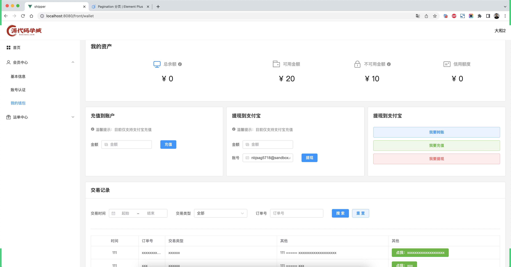
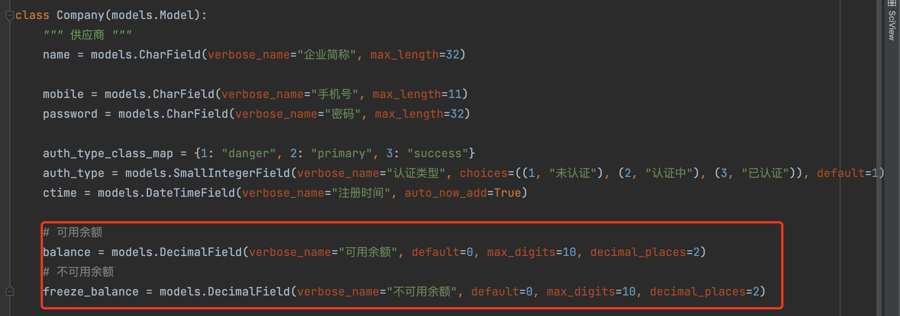
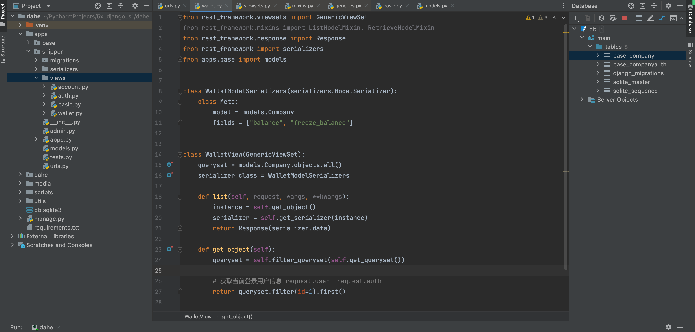
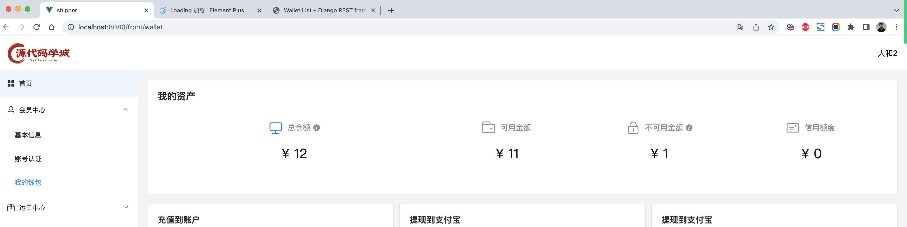

# day24 供应链系统

今日概要：

- 我的钱包，例如：充值、提现、交易记录

- 发布运单，例如：发布任务

- 运单管理

- 电子签（在线签合同）

  ```
  平台 + 供应商
  平台 + 司机
  ```

  ```
  - 模板合同，上传一个模板到腾讯电子签平台 + 编辑  => API发起签合同 => 链接 => 小程序签署
  - 文件合同，编写PDF合同 => 上传 => 关键字寻找签章位置 => API发起签合同 => 链接 => 小程序签署
  ```

  注意：企业用户（沙箱环境无法使用）


# 1.我的钱包


## 1.1 我的资产


### 1.页面

详见示例：**src-1.zip**




### 2.资产数据

> 当页面加载时，向后台发送请求，获取数据并展示。

- 表结构修改
  

- 获取数据时，URL的设计

  ```
  https://www.xxx.com/api/users/
  	GET，数据列表
  	POST，新建
  	
  https://www.xxx.com/api/users/12/
  	GET，单条数据
  	PUT
  	PATCH
  	DELETE
  ```

  ```
  我的资产：
  	https://www.xxx.com/api/wallet/用户ID/
  	
  我的资产（本次）：
  	https://www.xxx.com/api/wallet/?token=...
  ```

  ```
  关于代码存放位置，分类维度：
  	- 业务功能（我们）
  		router.register(r'basic', basic.BasicView)
          router.register(r'auth', auth.AuthView)
          router.register(r'wallet', wallet.AuthView)
  	- 表结构
  		router.register(r'company', basic.CompanyView)
  		router.register(r'company/wallet', basic.CompanyWalletView)
  ```

  ```
  https://www.xxx.com/api/wallet/      GET     list
  	from rest_framework.mixins import ListModelMixin
  	[
  		{...},
  		{...},
  	]
  	
  https://www.xxx.com/api/wallet/11/   GET     retrieve
  	from rest_framework.mixins import RetrieveModelMixin
  	{...}
  ```

  ```
  https://www.xxx.com/api/wallet/
  	list + 单条数据
  	{...}
  ```

  

  

- 前端

  ```
  axios发送请求 + token信息（请求头）
  ```

  


最终实现效果：

详细示例：`dahe-2.zip`   `src-2.zip`




## 1.2 充值和提现


### 1.充值

详细示例：`dahe-3.zip`   `src-3.zip`

- 输入金额 + 点击充值

- 后端接收请求，生成链接（返回浏览器）

  ```
  /api/shipper/wallet/charge/
  POST
  {amount:100}
  ```

- 跳转过去支付，完成后

  - 跳转回网站（更新状态）
  - 异步通知，更新状态（部署线上环境）。

- 优化

- 扩展

  - 再次支付
  - 订单的取消
    - 自己取消（我们的表结构数据更新状态）
    - 支付宝撤单


### 2.提现

详细示例：`dahe-4.zip`   `src-4.zip`

- 获取  金额+账户 ，发送后端
- 后端
  - 自己账户可用余额 > 提现金额
  - 自动成功        【生成一条记录 + 管理审核 + 手续费】
    - 提现记录
    - 余额更新


注意：不同于充值，直接发送请求，返回值是 成功/失败 。


## 1.3 交易记录


### 1.获取表格数据

- 前端发送请求

- 后端获取返回

  ```
  https://www.xxx.com/api/users/
  	GET，数据列表
  	POST，新建
  	
  https://www.xxx.com/api/users/12/
  	GET，单条数据
  	PUT
  	PATCH
  	DELETE
  ```

- 做呈现


### 2.筛选

- api想要实现筛选

  ```
  http://127.0.0.1:8000/api/shipper/wallet/tran/?page=1&v1=xxx&xxx=999
  ```

- 提现代码

  ```javascript
  let search_params = {page: state.page.currentPage};
  
  # 读取表单中设置的值
  
  proxy.$axios.get(`/api/shipper/wallet/tran/`, {params: search_params})
  ```

  

# 任务

- 判断 交易类型 + 支付状态 判断是否显示   重新支付     取消

- 绑定事件

- 重新支付

  - 携带交易记录的ID，获取交易信息（amount、trans_id）
  - 生成支付链接
  - 页面跳转

- 取消

  - 携带交易记录的ID，获取交易信息（amount、trans_id）

  - 对照支付宝API（转账）

    ```
    https://opendocs.alipay.com/open/028wob
    ```

  - 发送请求

- 预习，学习看官方文档，根据官方文档来实现某些功能。

  ```
  https://ess.tencent.cn/login
  
  https://cloud.tencent.com/document/product/1323/70377
  ```

  


