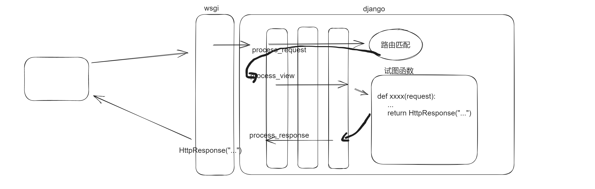
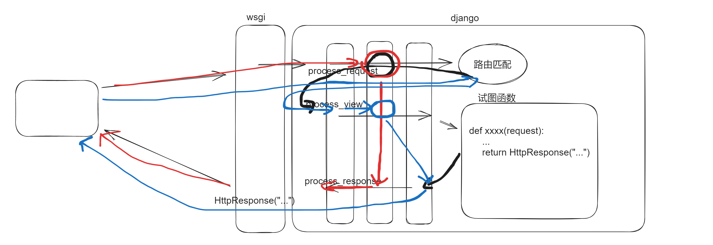
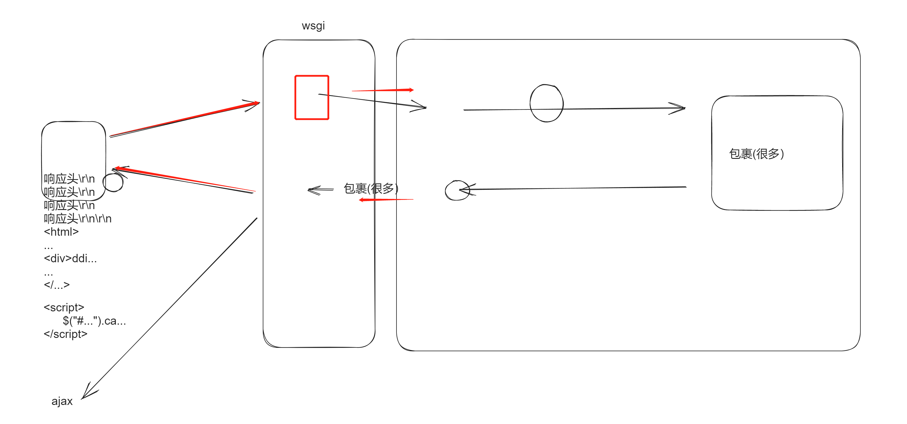
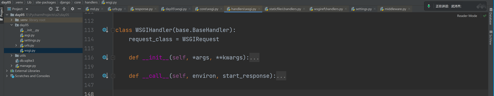
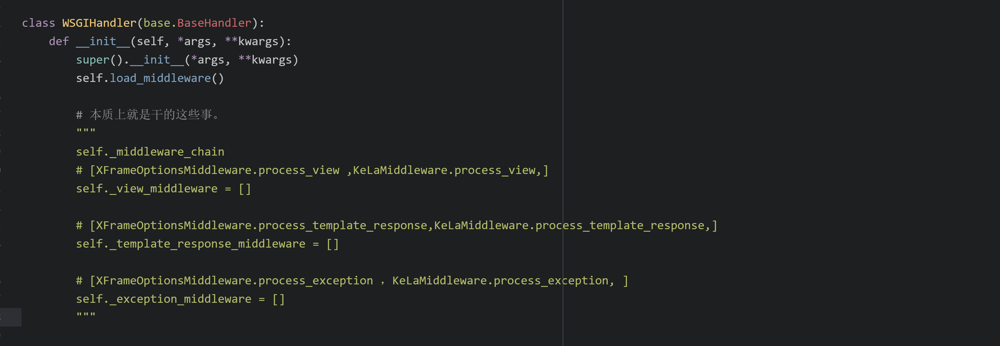
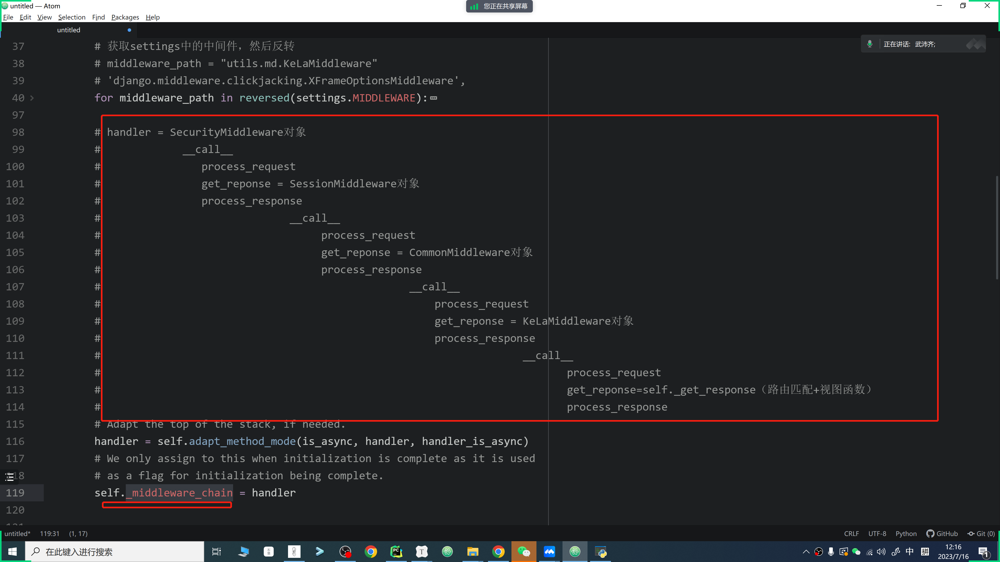
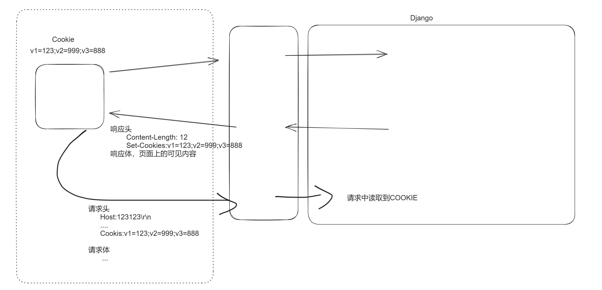
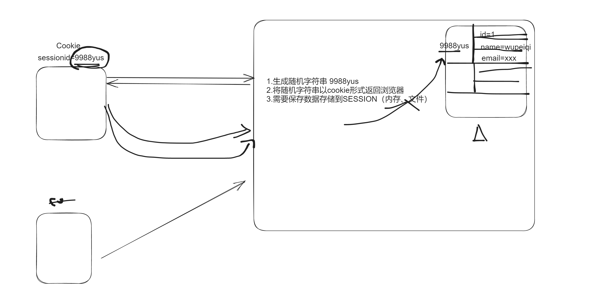

# day05 django知识点

今日概要：

- 中间件  【使用】【源码】
- cookie 【使用】【源码 - Django底层请求本质】
- session【使用】【源码 - 数据库+请求周期+中间件】


# 1.中间件


## 1.1 使用

- 编写类，在类型定义：process_request、process_view、process_response
- 中间件注册，在settings中的配置。


### 1.1.1 正常




#### 1.编写类

可以写在任意的目录：自定义的类、继承一个类**（推荐）**

```python
from django.utils.deprecation import MiddlewareMixin

class KeLaMiddleware(MiddlewareMixin):

    def process_request(self, request):
        # request是请求相关所有的数据
        pass

    def process_view(self, request, view, *args, **kwargs):
        # request是请求相关所有的数据； view是试图函数； 路由参数*args, **kwargs
        pass

    def process_response(self, request, response):
        # request是请求相关所有的数据
        # response是试图函数返回的那个对象（封装了要返回到用户浏览器的所有数据）
        return response
```


#### 2.注册

```python
MIDDLEWARE = [
    'django.middleware.security.SecurityMiddleware',
    'django.contrib.sessions.middleware.SessionMiddleware',
    'django.middleware.common.CommonMiddleware',
    'django.middleware.csrf.CsrfViewMiddleware',
    'django.contrib.auth.middleware.AuthenticationMiddleware',
    'django.contrib.messages.middleware.MessageMiddleware',
    'django.middleware.clickjacking.XFrameOptionsMiddleware',
    "utils.md.KeLaMiddleware"
]
# 动态导入 + 反射
```


#### 3.测试

```python
from django.utils.deprecation import MiddlewareMixin


class KeLaMiddleware(MiddlewareMixin):

    def process_request(self, request):
        print("KeLa.process_request")

    def process_view(self, request, view, *args, **kwargs):
        print("KeLa.process_view",view, *args, **kwargs)

    def process_response(self, request, response):
        print("KeLa.process_response")
        return response
```

```python
from django.contrib import admin
from django.urls import path
from django.shortcuts import HttpResponse


def x1(request):
    print("视图.x1")
    return HttpResponse("x1")


def x2(request, v1):
    print("视图.x2", v1)
    return HttpResponse("x2")


urlpatterns = [
    path('admin/', admin.site.urls),
    path('x1/', x1),
    path('x2/<int:v1>/', x2),
]
```

```python
MIDDLEWARE = [
    'django.middleware.security.SecurityMiddleware',
    'django.contrib.sessions.middleware.SessionMiddleware',
    'django.middleware.common.CommonMiddleware',
    'django.middleware.csrf.CsrfViewMiddleware',
    'django.contrib.auth.middleware.AuthenticationMiddleware',
    'django.contrib.messages.middleware.MessageMiddleware',
    'django.middleware.clickjacking.XFrameOptionsMiddleware',
    "utils.md.KeLaMiddleware"
]
```


#### 4.问题

- 中间件的功能好像有点像装饰器【底层源码闭包】

- 基于中间件可以做什么？

  - 根据请求周期，对 request 进行赋值，后续方便进行调用。

  - 根据请求周期，对业务逻辑代码进行自定义，决定是否可以继续向后

    - return None，继续向后走

    - return HttpResponse对象

      ```
      return HttpResponse("...")
      return render("...")        ->   HttpResponse("...")
      return JsonReponse("...")   ->   HttpResponse("...")
      ```

  - 根据请求周期，对返回给用户浏览器的数据进行自定义：删除内容、增加、cookie、响应头...


- 这个中间件和nginx  apache这样的**中间件**概念一样吗？比如做前置代理，做https

  ```
  Django中间件  /  拦截器  / RequestHanler
  ```

- 中间件可以跨语言调用吗？比如别人不是用python 写的，但是可以给我们的django 项目用？

  ```
  Django中间件
  	...
  架构中间件：
  	Django + redis（C语言）
  ```

- 中间件只要两层,不要中间那个process.riew行不行,是不是有些特定场合需要返回最后一层

  ```
  ...
  ```

- 那Django内置的中间件完成了些什么功能？

  ```
  ...
  ```

  

### 1.1.2 “不正常”



如果用户向我的网站请求时，如果访问URL：

- /x1/
- /x2/
- /x3/ ，比如携带凭证token，有凭证继续，无凭证返回无权访问。

```
http://127.0.0.1:8000/x2/12/
http://127.0.0.1:8000/x2/12/?xxx=123

http://127.0.0.1:8000/x3/?token=12938791923981723123
```

```python
from django.utils.deprecation import MiddlewareMixin
from django.shortcuts import HttpResponse


class KeLaMiddleware(MiddlewareMixin):

    def process_request(self, request):
        # request.path_info
        # print(request.path_info,"KeLa.process_request")
        if request.path_info == "/x3/":
            token = request.GET.get('token')
            if token == "12938791923981723123":
                return
            else:
                return HttpResponse("无权访问")
```


如果用户向我的网站请求时，如果访问URL：

- /x1/

- /x2/  ，比如携带凭证token，有凭证继续，无凭证返回无权访问。

  ```
  x2/<int:v1>/', x2
  
  http://127.0.0.1:8000/x1/10/
  http://127.0.0.1:8000/x1/20/
  http://127.0.0.1:8000/x1/11/
  ```

- /x3/

```python

class KeLaMiddleware(MiddlewareMixin):

    def process_request(self, request):
        # request.path_info
        # print(request.path_info,"KeLa.process_request")
        # 以x2开头 或 正则   /x2/1111/   /x2/10/
        # if request.path_info == "/x2/":
        if request.path_info.startswith("/x2/"):
            token = request.GET.get('token')
            if token == "12938791923981723123":
                return
            else:
                return HttpResponse("无权访问")
```

```python
class KeLaMiddleware(MiddlewareMixin):

    def process_view(self, request, view, *args, **kwargs):
        # request.path_info
        # print(request.path_info,"KeLa.process_request")
        url_name = request.resolver_match.url_name
        if url_name == "x2":
            token = request.GET.get('token')
            if token == "12938791923981723123":
                return
            else:
                return HttpResponse("无权访问")
```


关于自定义prcess_response，一般用于对请求要返回的数据进行修改。

```python
class KeLaMiddleware(MiddlewareMixin):

    def process_response(self, request, response):
        response["xx"] = "wupeiqi"
        return response
```


### 答疑

- Settings 里面的中间件有多个组件，那运行项目时的执行顺序是怎样的？是执行完这些中间件再执行路由匹配吗？后面写的中间件是不是要对前面的中间件功能非常清楚才行、避免可能功能覆盖带来bug?
- 這邊定義的響應頭在用戶下一次訪問的時候會帶上麽
- js可以读到content的内容吗
- 刚才讲的这个response返回值的修改，增加了一个“xx”=“wupeiqi”，这种操作应该也可以增加的request请求头里面吧，那request增加的，是不是就和爬虫里面的某些js逆向参数，就是从这里来的？


## 1.2 使用（几乎不用）

- 编写类，在类型定义：process_request、process_view、process_response、process_exception、process_template_response

  ```
  process_exception，视图函数有异常，处理出现异常时
  process_template_response，对于视图函数返回内容渲染扩展。
  	- 在视图函数中如果返回的对象内部有一个render方法且可以被调用执行
  	- process_template_response返回response参数（返回值）
  	- 在自定义的MyReponse的render方法中必须返回HttpRespose
  ```

- 中间件注册，在settings中的配置。


```python
class KeLaMiddleware(MiddlewareMixin):

    def process_exception(self, request, exception):
        print(request)
        print(exception, type(exception))
        return HttpResponse("错误了")
```


```python
def x1(request):
    print("视图.x1")
    return HttpResponse("x1")
```


```python
class MyHttpResponse:
    def __init__(self, body):
        self.body = body

    def render(self):
        return HttpResponse(self.body)  # 真正的返回


def x1(request):
    print("视图.x1")
    return MyHttpResponse("x1")
```

```python
class KeLaMiddleware(MiddlewareMixin):

    def process_template_response(self, request, response):
        return response
```


----

```python
def x1(request):
    print("视图.x1")
    return HttpResponse("源代码-x1")


def x2(request, v1):
    return HttpResponse("源代码-x2")


def x3(request):
    return HttpResponse("源代码-x3")
```

---

```python

class MyHttpResponse:
    def __init__(self, body):
        self.body = body

    def render(self):
        return HttpResponse(self.body)


def x1(request):
    print("视图.x1")
    return MyHttpResponse("x1")


def x2(request, v1):
    return MyHttpResponse("x2")


def x3(request):
    return MyHttpResponse("x3")

```

```python
class KeLaMiddleware(MiddlewareMixin):

    def process_template_response(self, request, response):
        response.body = f"源代码-{response.body}"
        return response
```


## 1.3 源码

### 1.关于请求



```python
from wsgiref.simple_server import make_server


def run_server(environ, start_response):
    # 只要请求到来，就会走这里的代码
    # 1.根据请求 environ 进行后续业务处理
    # 2.返回内容。。。
    start_response('200 OK', [('Content-Type', 'text/html')])
    return [bytes('<h1>Hello, web!</h1>', encoding='utf-8'), ]


if __name__ == '__main__':
    httpd = make_server('127.0.0.1', 8000, run_server)  # # 有请求到来时，执行  obj(environ, start_response)
    httpd.serve_forever()
```


```python
from wsgiref.simple_server import make_server

class Handler:
    
    def __init__(self):
        # 做一些初始化动作
        self.name = "wupeiqi"
        
	
    def __call__(self,environ, start_response):
        # 根据初始化的动作，去执行...
        # ...
        start_response('200 OK', [('Content-Type', 'text/html')])
    	return [bytes('<h1>Hello, web!</h1>', encoding='utf-8'), ]


if __name__ == '__main__':
    obj = Handler() # 执行 
    httpd = make_server('127.0.0.1', 8000, obj)  # 有请求到来时，执行 obj(environ, start_response)
    httpd.serve_forever()
```




### 2.启动Django项目`WSGIHandler.__init__` 






### 3.请求到来`WSGIHandler.__call__` 

流程：中间件的执行、路由匹配、视图函数的执行。


### 小结

- 1.7.x源码，底层实现，是基于好几个列表。

- 4.x源码，

  ```
  函数的作用域 + 闭包 + 装饰器
  面向对象 + __call__方法
  ```

  ```
  # 核心
  # handler = SecurityMiddleware对象
  #             __call__
  #                process_request
  #                get_reponse = SessionMiddleware对象
  #                process_response 
  #                              __call__
  #                                   process_request 
  #                                   get_reponse = CommonMiddleware对象
  #                                   process_response
  #                                                 __call__
  #                                                     process_request
  #                                                     get_reponse = KeLaMiddleware对象
  #                                                     process_response
  ```

  

### 答疑

- 没悟透，不需要吾、只需要懂【不需要背+建立】
- 有些难
  - 入门，听懂+能用（全家桶）
  - 文档，用法没有源码。
  - 源码，到底是怎么实现的功能（不修改、扩展）【*】
- 感觉听懂了，但又不清楚，这是不是**学源码**的正常情况，看B站视频写程序都很简单，也容易懂
- 课下还是得自己分析分析，一定会忘记


# 2.Cookie

本质上：保存在用户浏览器上键值对。




## 2.1 使用

```python
from django.urls import path
from django.shortcuts import HttpResponse


def x1(request):
    # 包含：响应体、响应头、状态码等信息
    obj = HttpResponse("x1", status=201, reason="OK")
    # 设置响应头
    obj['name'] = "wupeiqi"

    # 设置cookie
    # import datetime
    # ctime = datetime.datetime.now() + datetime.timedelta(seconds=10)
    
    obj.set_cookie("v3", "root", max_age=10, path="/")
    obj.set_cookie("v2", "hello")
    obj.set_signed_cookie("info", "xiaoguang")  # 签名
    return obj


def x2(request):
    print(request.COOKIES)
    xx = request.get_signed_cookie("info")  # 用户不能自己修改cookie的内容
    print(xx)
    # print(request.COOKIES.get('v1'))
    # print(request.COOKIES.get('v2'))
    return HttpResponse("x2")


urlpatterns = [
    path('x1/', x1, name='x1'),
    path('x2/', x2, name='x2'),
]
```


## 2.2 源码

- HttpResponse，包裹

  ```python
  # 包含：响应体、响应头、状态码等信息
  obj = HttpResponse("x1", status=201, reason="OK")
  
  # 设置响应头
  obj['name'] = "wupeiqi"
  
  # 设置cookie
  # import datetime
  # ctime = datetime.datetime.now() + datetime.timedelta(seconds=10)
  
  obj.set_cookie("v3", "root", max_age=10, path="/")
  obj.set_cookie("v2", "hello")
  
  obj.set_signed_cookie("info", "xiaoguang")  # 签名
  return obj
  ```

- WSGIRequest

  ```python
  class WSGIHandler(base.BaseHandler):
      request_class = WSGIRequest
  
      def __init__(self, *args, **kwargs):
          super().__init__(*args, **kwargs)
          self.load_middleware()
  
      def __call__(self, environ, start_response):
          set_script_prefix(get_script_name(environ))
          signals.request_started.send(sender=self.__class__, environ=environ)
  
          request = self.request_class(environ)
  ```

  ```python
  class HttpRequest:
      def get_signed_cookie(self, key, default=RAISE_ERROR, salt="", max_age=None):
          cookie_value = self.COOKIES[key]
          value = signing.get_cookie_signer(salt=key + salt).unsign(cookie_value, max_age=max_age)
  		return value
  
  class WSGIRequest(HttpRequest):
      def __init__(self, environ):
          self.environ = environ
          ...
          
      @cached_property
      def COOKIES(self):
          raw_cookie = get_str_from_wsgi(self.environ, "HTTP_COOKIE", "")
          return parse_cookie(raw_cookie)
  ```

  


# 3.Session

Session的使用一般依赖于Cookie，将一些数据不再发送值浏览器，而是保存的后端的服务器上。



## 3.1 使用

- Session到底要存储到哪里？默认数据库。

  ```python
  INSTALLED_APPS = [
      'django.contrib.admin',
      'django.contrib.auth',
      'django.contrib.contenttypes',
      # 'django.contrib.sessions',     # sessions功能的APP    django_session
      'django.contrib.messages',
      'django.contrib.staticfiles',
  ]
  ```

  ```python
  MIDDLEWARE = [
      'django.middleware.security.SecurityMiddleware',
      'django.contrib.sessions.middleware.SessionMiddleware', # process_request/process_response
      'django.middleware.common.CommonMiddleware',
      'django.middleware.csrf.CsrfViewMiddleware',
      'django.contrib.auth.middleware.AuthenticationMiddleware',
      'django.contrib.messages.middleware.MessageMiddleware',
      'django.middleware.clickjacking.XFrameOptionsMiddleware',
      # "utils.md.KeLaMiddleware",
  ]
  ```

  ```python
  ############
  # SESSIONS #
  ############
  # Session存储在哪里？
  SESSION_ENGINE = "django.contrib.sessions.backends.db"
  
  # 如果存储到文件中，文件的路径。
  SESSION_ENGINE = "django.contrib.sessions.backends.file"
  SESSION_FILE_PATH = None
  
  # 存储到缓存
  SESSION_ENGINE = "django.contrib.sessions.backends.cache"
  SESSION_CACHE_ALIAS = "default"
  
  
  # 存储到缓存 + 数据库
  SESSION_ENGINE = "django.contrib.sessions.backends.cache_db"
  SESSION_CACHE_ALIAS = "default"
  
  # 存储到cookie
  SESSION_ENGINE = "django.contrib.sessions.backends.signed_cookies"
  
  # class to serialize session data
  SESSION_SERIALIZER = "django.contrib.sessions.serializers.JSONSerializer"
  
  
  # -------------------------------
  # Cookie name. This can be whatever you want.
  SESSION_COOKIE_NAME = "sessionid"
  # Age of cookie, in seconds (default: 2 weeks).
  SESSION_COOKIE_AGE = 60 * 60 * 24 * 7 * 2
  # A string like "example.com", or None for standard domain cookie.
  SESSION_COOKIE_DOMAIN = None
  # Whether the session cookie should be secure (https:// only).
  SESSION_COOKIE_SECURE = False
  # The path of the session cookie.
  SESSION_COOKIE_PATH = "/"
  # Whether to use the HttpOnly flag.
  SESSION_COOKIE_HTTPONLY = True
  # Whether to set the flag restricting cookie leaks on cross-site requests.
  # This can be 'Lax', 'Strict', 'None', or False to disable the flag.
  SESSION_COOKIE_SAMESITE = "Lax"
  # Whether to save the session data on every request.
  SESSION_SAVE_EVERY_REQUEST = False
  # Whether a user's session cookie expires when the web browser is closed.
  SESSION_EXPIRE_AT_BROWSER_CLOSE = False
  ```

  注意：如果是非数据库，可以主调用app的注册代码部分。

- 请求=登录，生成Session、Cookie。

- 再次请求，默认携带cookie，根据Cookie中的凭证，去找到Session中原本存储的数据。

  ```
  request.session['id'] = 999
  request.session['id'] = 88
  request.session.get("id")
  
  # del request.session['id']
  # request.session.clear()
  ```

  ```python
  from django.urls import path
  from django.shortcuts import HttpResponse
  
  def x1(request):
      request.session['id'] = 999
      request.session['name'] = 'wupeiqi'
      request.session['age'] = '25'
      return HttpResponse("x1")
  
  def x2(request):
      print(request.session.get("id"))
      print(request.session.get("name"))
      print(request.session.get("age"))
  
      return HttpResponse("x2")
  
  urlpatterns = [
      path('x1/', x1, name='x1'),
      path('x2/', x2, name='x2'),
  ]
  ```


## 3.2 源码


### 1.引擎配置

- 数据库引擎

  ```python
  SESSION_ENGINE = "django.contrib.sessions.backends.db"
  ```

  ```python
  INSTALLED_APPS = [
      'django.contrib.sessions',
      'django.contrib.messages',
      'django.contrib.staticfiles',
  ]
  ```

  ```
  >>>python manage.py makemigrations
  >>>python manage.py migrate
  ```

- 文件

  ```
  # 如果存储到文件中，文件的路径。
  SESSION_ENGINE = "django.contrib.sessions.backends.file"
  SESSION_FILE_PATH = None
  ```

  ```
  INSTALLED_APPS = [
      #'django.contrib.sessions',
      'django.contrib.messages',
      'django.contrib.staticfiles',
  ]
  ```


### 2.中间件

```python
MIDDLEWARE = [
    'django.middleware.security.SecurityMiddleware',
    'django.contrib.sessions.middleware.SessionMiddleware',  # 必须设置
    'django.middleware.common.CommonMiddleware',
    'django.middleware.csrf.CsrfViewMiddleware',
	...
]
```


#### 2.1 创建对象

在启动django程序时，会自动创建 SessionMiddlewared对象。

```python
class MiddlewareMixin:

    def __init__(self, get_response):
        self.get_response = get_response

class SessionMiddleware(MiddlewareMixin):
    def __init__(self, get_response):
        super().__init__(get_response)

        # "django.contrib.sessions.backends.db"   "django.contrib.sessions.backends.file"
        engine = import_module(settings.SESSION_ENGINE)

        # db.SessionStore    file.SessionStore
        self.SessionStore = engine.SessionStore
```


#### 2.2 请求到来 * 

```python

def process_request(self, request):
    # 1.去Cookie中读取凭证 mid="123123123123"
    session_key = request.COOKIES.get(settings.SESSION_COOKIE_NAME)
    # 2.实例化
    request.session = self.SessionStore(session_key)
```

```python
def x1(request):
	# request.session -> file.SessionStore() / 
    
    
    request.session['id'] = 999
    request.session['name'] = 'wupeiqi'    类中的__setitem__
    request.session['age'] = '25'

    return HttpResponse("x1")
```


#### 2.3 请求结束 *

```
...
```


# 总结

- 使用角度：
  - 中间件
  - Cookie
  - Session：Cookie + 中间件
- 源码流程：
  - 中间件、cookie、session


# 答疑

- 老师，cookie过期时间设置以后，请求的时候是在哪块判断的cookie是否过期

  ```
  data = request.COOKIES.get("v1")
  
  # 过期或未设置
  ```

- 老师 那session以文件方式存储，那每次运行都会覆盖上一次的吗

  - 覆盖
  - 是否变更

- 每个浏览器应该是不同的文件吧

- 有个基础知识问题：*response.Item这里的*干什么的？

- 一个用户ID  是不是只会 对应一个 session,,,比如更换浏览器访问，后台就会被变更了  对吧

  ```
  A浏览器
  B浏览器
  ```

  


