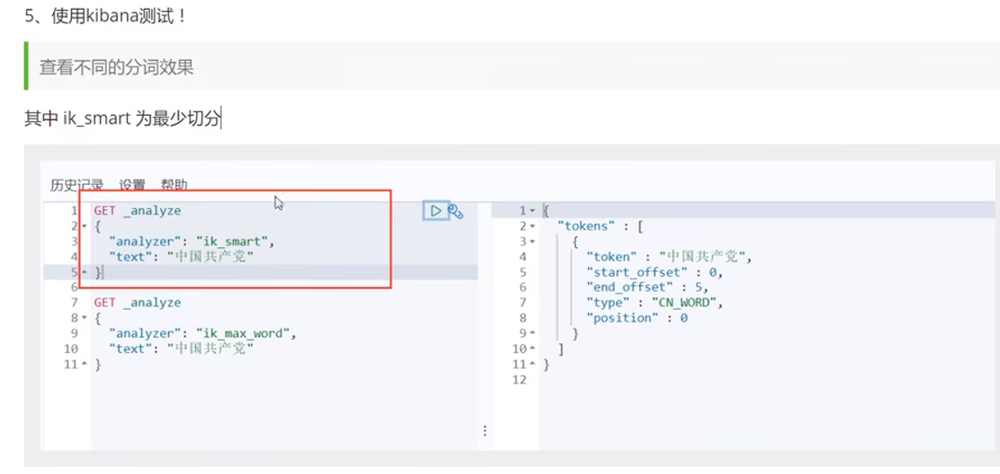

# elasticsearch

## 安装可视化界面es  head的插件

+ 下载地址

  

+ 启动

  ~~~linux
  npm install
  npm run start
  ~~~

+ 连接测试发现，存在跨域问题：配制es

  ~~~shell
  # 开启跨域  允许所有
  http.cors.enabled: true
  http.cors.allow-origin: "*"
  ~~~

+ 重启es服务

### 解决跨域问题：

+ es head 可视化 es跨域问题  9001连接9002

## ELK

## 安装Kibana

## ES核心概念

+ 一切都是json 
+ 

## IK分词器

+ 发现问题：输入狂神说，被拆开了
+ 这种自己需要的词，需要自己加到我们分词器的字典中

## Rest风格说明

### 数据类型

### 创建索引和对应的type(类似于数据库中字段)

+ 创建规则

+ 获得这个规则，可以通过get请求。获取具体的信息

  

+ 查看默认的信息

  _doc默认的，（type将要被淘汰）

  

### 修改索引

+ 之前用法

  

+ 最新用法 使用POST方法，后面加_update

  

### 删除索引

+ 通过DELETE命令，根据你的请求判断是删除索引还是删除索引下的文档

## 关于文档的基本操作

### 复杂操作搜索

### 输出结果不想要很多 （类似于 select name desc form ***）

### 排序

### 分页 

### 布尔值查询

+ and  must

+ or should

  

+ not  must_not

  

+ 过滤器 filter

  

+ 条件查询

  

+ 精确查询

  term查询是直接通过倒排索引指定的词条进程精确查找的

  关于分词：

  - term,直接查询精确的

  ​	

  - match,. 会使用分词器解析，（先分析文档，然后再通过分析的文档进行查询）

  ​	

  

+ 两个类型 text  keyword

  + 创建文档

    

  + 插入数据

    

  + 查找testdb

    

  

  + 

  + 

  + 查找 GET

    + 没有被分析  keyword

    、

    + 分析了 默认

  

### 高亮查询 

## Python创建索引

## 插入数据

https://blog.csdn.net/JAY_jzj/article/details/105079415

