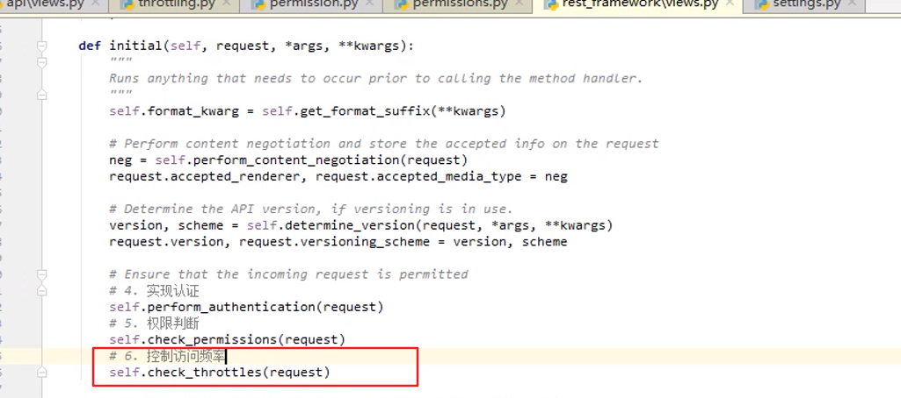
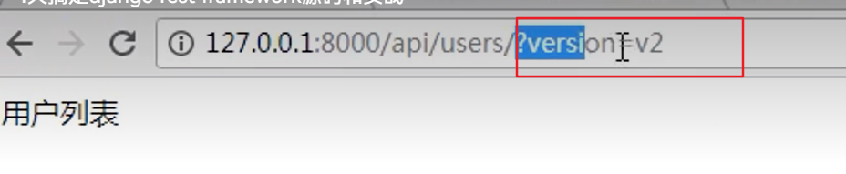

# rest_framwork前后端分离 34

## CBV上权限校验

+ 类的下面的所有方法都去除权限校验了

  

-----------------------------------------------------------

## restful规范

### 状态码

### 你是如何理解rest framework的（面试题10点）

-------------------------

## rest-framework认证  --源码刨析

**流程图**  --返回三个error    元组     None

+ **源码   ---入口dispatch**

  

+ **封装了request**

  

  

+ **执行构造的authentication--必须返回元组并且是两个**

  

+ **可以配置文件里加--将权限校验的函数写到utils工具类里，所有方法都需要认证**

  

## day1作业-面试重点:

+ 中间件
  - process_request
  - process_view
  - process_respone
  - process_exception
  - process_render_template
+ csrf
  
+ 
  
+ CBV本质

+ restful   规范

  - **10条**

    - 协议：API与用户的通信协议，总是使用[HTTPs协议

    - 域名：应该尽量将API部署在专用域名之下https://api.example.com或者 https://example.org/api/

    - 版本最好放在url后面  ： *https*://api.example.com/v1/

    - 路径：在RESTful架构中，每个网址代表一种资源（resource），所以网址中不能有动词，只能有名词，而且所用的名词往往与数据库的表格名对应。一般来说，数据库中的表都是同种记录的"集合"（collection），所以API中的名词也应该使用复数

      - https://api.example.com/v1/animals

    - HTTP动词

      GET（SELECT）：从服务器取出资源（一项或多项）。
      POST（CREATE）：在服务器新建一个资源。
      PUT（UPDATE）：在服务器更新资源（客户端提供改变后的完整资源）。
      PATCH（UPDATE）：在服务器更新资源（客户端提供改变的属性）。
      DELETE（DELETE）：从服务器删除资源。

      （不太常用2个）

      ​	HEAD：获取资源的元数据。

      ​	OPTIONS：获取信息，关于资源的哪些属性是客户端可以改变的

    - 过滤信息（Filtering）

      ?limit=10：指定返回记录的数量
      ?offset=10：指定返回记录的开始位置。
      ?page=2&per_page=100：指定第几页，以及每页的记录数。
      ?sortby=name&order=asc：指定返回结果按照哪个属性排序，以及排序顺序。
      ?animal_type_id=1：指定筛选条件

    - 状态码

      200 OK - [GET]：服务器成功返回用户请求的数据，该操作是幂等的（Idempotent）。
      201 CREATED - [POST/PUT/PATCH]：用户新建或修改数据成功。
      202 Accepted - [*]：表示一个请求已经进入后台排队（异步任务）
      204 NO CONTENT - [DELETE]：用户删除数据成功。
      400 INVALID REQUEST - [POST/PUT/PATCH]：用户发出的请求有错误，服务器没有进行新建或修改数据的操作，该操作是幂等的。
      401 Unauthorized - [*]：表示用户没有权限（令牌、用户名、密码错误）。
      403 Forbidden - [*] 表示用户得到授权（与401错误相对），但是访问是被禁止的。
      404 NOT FOUND - [*]：用户发出的请求针对的是不存在的记录，服务器没有进行操作，该操作是幂等的。
      406 Not Acceptable - [GET]：用户请求的格式不可得（比如用户请求JSON格式，但是只有XML格式）。
      410 Gone -[GET]：用户请求的资源被永久删除，且不会再得到的。
      422 Unprocesable entity - [POST/PUT/PATCH] 当创建一个对象时，发生一个验证错误。
      500 INTERNAL SERVER ERROR - [*]：服务器发生错误，用户将无法判断发出的请求是否成功。

    - 错误处理

      如果状态码是4xx，就应该向用户返回出错信息。一般来说，返回的信息中将error作为键名，出错信息作为键值即可。

      {

      ​    error: "Invalid API key"

      }

    - 返回结果

      GET /collection：返回资源对象的列表（数组）
      GET /collection/resource：返回单个资源对象
      POST /collection：返回新生成的资源对象
      PUT /collection/resource：返回完整的资源对象
      PATCH /collection/resource：返回完整的资源对象
      DELETE /collection/resource：返回一个空文档

    - Hypermedia API

      RESTful API最好做到Hypermedia，即返回结果中提供链接，连向其他API方法，使得用户不查文档，也知道下一步应该做什么。

      比如，当用户向api.example.com的根目录发出请求，会得到这样一个文档

    - 其他

         (1)   API的身份认证应该使用[OAuth 2.0](http://www.ruanyifeng.com/blog/2014/05/oauth_2_0.html)框架。

      （2）服务器返回的数据格式，应该尽量使用JSON，避免使用XML。

    

+ 面向对象的认识

  - 三大特性：封装继承多态

+ django请求声明周期

  + url请求
  + process_request（中间件）
  + 视图
  + process_view（中间件）

+ djangorestframework

  - 如何认证（基于数据库实现用户认证）
  - 源码流程

-------------

## day2 rest framwork之用户登录

### 权限

+ has_permission()   return False表示认证失败 True表示认证成功

  

+ **要想自定义会优先选择自定义的（self），否则使用全局的**

### 频率    

#### 自定义频率限制(节流 )

使用

 自定义全局配置节流

抽离

**如果继承BaseThrottle  --好处，规范了需要实现的方法，三个(多了一个get_index,该方法是获取ip地址)**

**最终替代  ---都是基于allow_request来实现的**

**用户限制   --没分钟登录10次**

## 面试题

# day3

## 多态---举例

### 复习面试题

## 

## 版本  

可以放在url、get请求里、请求头里、namespace  --一般放到url上

### URL中通过GET传参----方法一

http://127.0.0.1:8000/api/users/?version=v2

#### 自定义版本

#### 内部自己也实现了

+ view

+ QueryParamterVersioning源码

+ 三个变量都是在配置文件里写的

  

+ setting.py配置文件

### 通过URL中传参----方法二

内部实现

- 笨办法自己每个view里都配置

URLPathVersioning

urls.py

+ 可以写在配置文件里

  

  - setting.py

    

  - view.py  不需要在单独加URLPathVersioning，全局配置

    

  

### 版本总结

## 解析器 

### 局部配置 

### 全局配置

##  序列化

举例：

### Serializer类--继承

### ModelSerializer---（Serializer的子类)

+ 添加了多的功能，不要写了，用 fields = "__all__"

  

### 总结

**补充：depth = 1  可以获取一对多的多表，和多对多的多表里的所有一级数据**

### 内容回顾

# day4

## 分页

