#  Vue知识点   老杜 p178

~~~html
<!DOCTYPE html>
<html lang="en">

<head>
    <meta charset="UTF-8">
    <meta http-equiv="X-UA-Compatible" content="IE=edge">
    <meta name="viewport" content="width=device-width, initial-scale=1.0">
    <title>Document</title>
</head>

<body>
    

        <h2>aaaa</h2>
        <!-- <h2>{{ a }}</h2> -->
        <template id="tem">
            <h1 >temmmm</h1>
        </template>
    

    
    
</body>

</html>
~~~

## v-bind v-model

## Vue实例

## Object.defineProperty

**注意：这样会出现死循环，访问color会一直调用get方法，给color赋值也会一直调用set方法()**

 

+ 解决方法--使用temp变量

  

## 数据代理机制的实现

### 这就是Vue可以通过 vm.target访问到值的原因---使用了动态数据代理

## Vue框架源代码解读

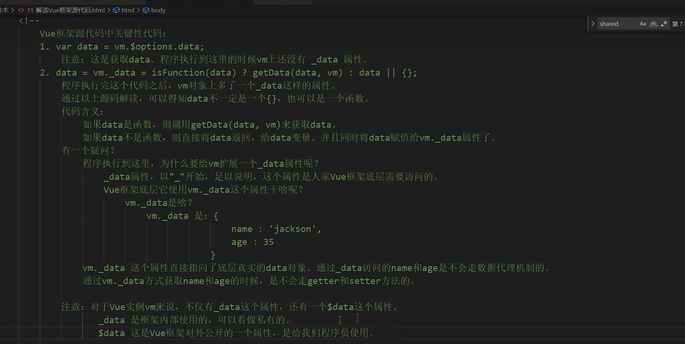

**如果程序员不想使用代理访问data,不推荐使用vm._data直接访问data里的数据，一般使用 vm.$data**

## 关于degfineProperty配置项

+ configurable

+ enumerable

  

## v-on:click    == @click

 

## this

+ 使用普通函数 this == vm

+ 箭头函数没有this

## methods实现原理

## 事件修饰符

+ self
+ stop
+ capture
+ once
+ prevent
+ passive 

 

## 按键修饰符

 

## 计算属性  - computed

+ 简写形式

  

## 监视---watch

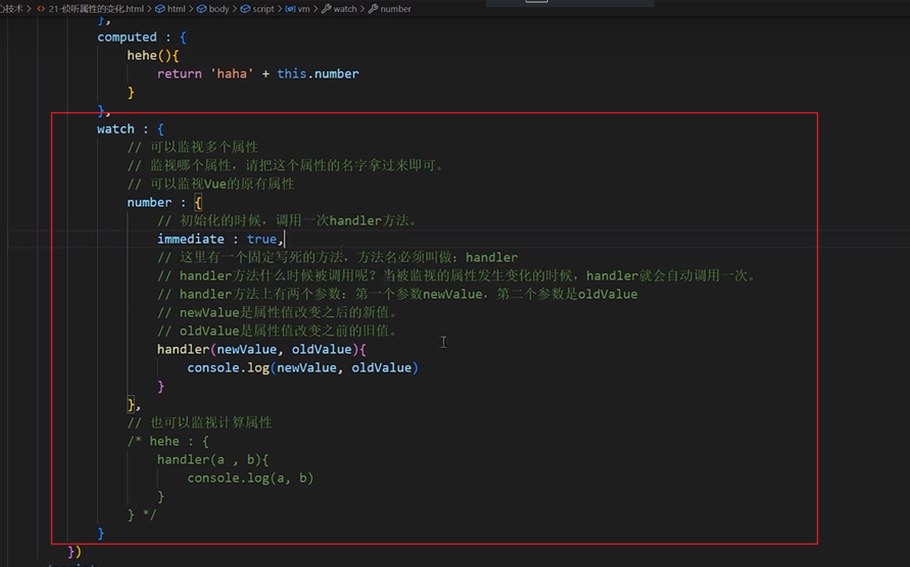

### 深度监视

### 后期添加监视

### 简写形式省略handler(没有其他参数的情况，只有handler)

### 后期添加监视简写形式

## watch和computed如何选择

## class绑定之数组和对象形式

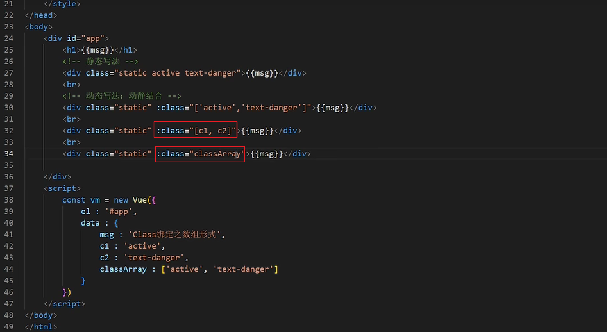

## v-if和v-show选择

## v-for

## diff算法和列表过滤

## V-model大全集

### 表单提交

### 对象转为json字符串

## filters

### 全局变量

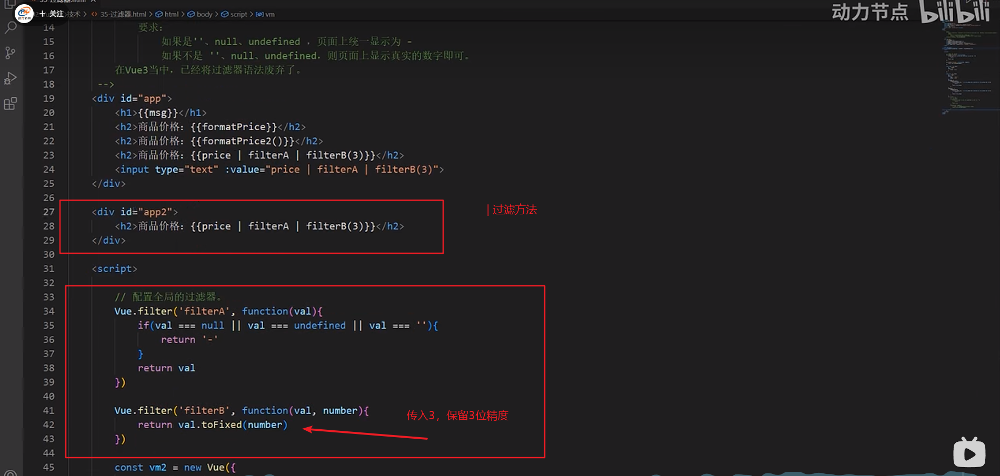

## v-cloak  -避免延迟显示

## 自定义指令

## 响应式与数据劫持

    

# Vue生命周期

   

## 初始阶段：虚拟DOM生成

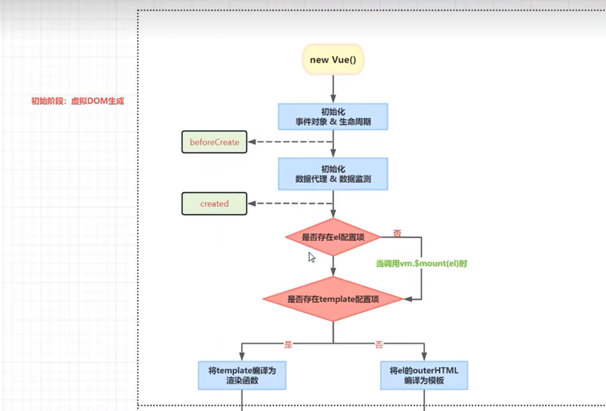

## 挂载阶段：真实DOM生成 

## 更新阶段：data变化重新渲染

## 销毁阶段：卸载所有，销毁vm

+ vm空间还在

# 组件化开发

 

## 组件的使用

### 局部组件定义和使用

+ 三步

### 全局组件注册

Vue.component("组件名", "定义的组件变量")

### 小细节：

+ 在Vue当中是可以使用自闭合标签的，但是前提必须在脚手架环境中使用

+ 在创建组件的时候Vue.extend（）是可以省略，但是底层实际上还是会调用，在注册组件的时候会调用

+ 组件的名字

  - 第一种：全部小写
  - 第二种：首字母大写，后面都是小写
  - 第三种：kebab-case命令发（user-login)
  - 第四种：UserLogin-------但这种方式只允许在脚手架环境中使用

  - 在创建组件的时候，通过配置项配置一个name, 这个name不是组件的名字，是设置Vue开发着工具中显示的组件的名字

## 组件的嵌套

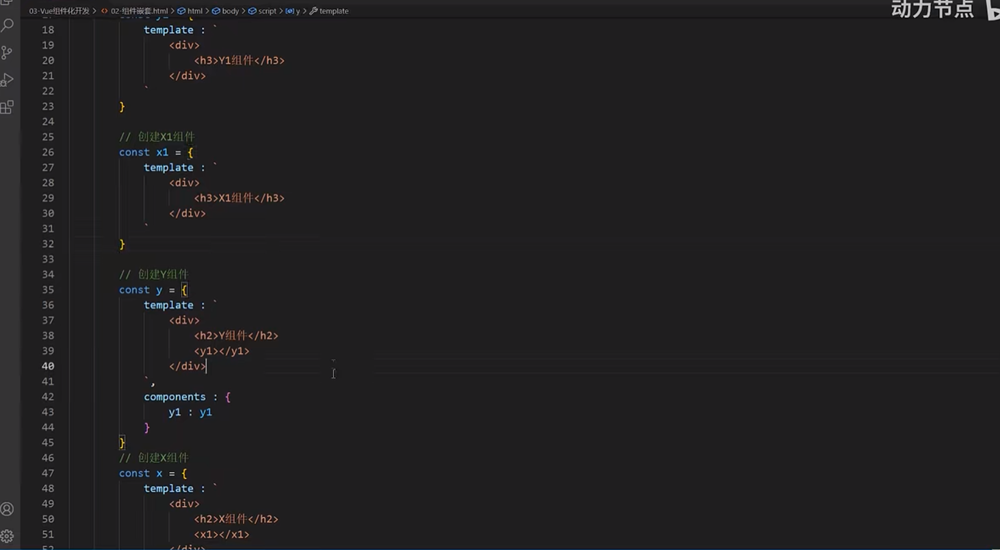

## vc和vm

 

## 补充：原型和原型链

+ 显示原型属性和隐式原型属性

  

  ~~~javascript
  // 原型对象只有一个，其实原型对象都是共享的
  
  console.log(x === y) // true
  
  // 这个不是给Vip扩展属性
  // 是在给Vip的原型对象扩展属性
  Vip.prototype.counter = 1000
  
  // 通过a实例可以访问这个扩展的cunter属性吗？ 可以访问，为什么 原理是啥
  // 访问原理：首先去a实例去找counter属性，如果a实例上没有counter属性的话，会沿着__proto__ 这个原型对象去找
  console.log(a.counter) // 1000
  
  console.log(a.__prototype__.counter) // 1000
  ~~~

  

### 组件能访问counter

+ Vue.prototype.counter = 1000
+ 原因：

~~~javascript
console.log(user.prototype.__proto__ === Vue.prototype)  // true
~~~

+ 组件化开发

  

# 脚手架vue-cli

+ index.html   ---vue脚手架会自动导入main.js

  

+ main.js    这里等同于引入vue.js文件

  

+ App.vue组件

  

+ **为什么使用render**

  

  - **方案一：使用完整版的vue**

    

  + **方案2： render函数  es6语法 render: h => h(App)         h变量实际是一个创建元素的函数，传入App组件，单行不需要写return语句**

    

# props属性使用 ---父串子

+ 组件传参，子级使用

+ 避免直接更改prop，因为每当父组件重新渲染时，该值都会被覆盖

+ 不要修改prop中的数据

  

# ref -从父组件中获取子组件

+ 可以获取dom元素和组件，近而获得元素里的属性

  

# mixins混入

+ **当和methods冲突时，methods里的方法优先生效**

  

  

+ **当出现钩子函数导入的时候，先执行导入的mix3钩子函数，后执行定义的**

  

  

+ **全局混入**

  

# plugins配置（插件）

+ **定义插件**

+ **导入插件**

 

# 局部样式 scoped

# 案例：

## 兄弟组件传递数据

+ 借用父组件过度一下，数据放到父组件上 

## 子组件想改父组件的值

+ 父组件在data里定义的值，通过子组件props接收后，不可以直接改，

+ 方法：通过把父组件的改data的methods方法传递给子组件，然后子组件改值

  

  

## 孙子组件想勾选/取消 勾选框

+ 方法

  

### 爷爷：

### 儿子：

### 孙子：

## 组件自定义事件

+ **this.$emit**
+ **子组件向父组件传递参数**                 以前通过app组件定义一个**函数**传到子组件，使用props，然后子组件调用这个函数(传入子组件的值，调用了父组件的函数)

+ 通过代码给子组件绑定事件

  

+ 解绑

  

+ 扩展  --this指向问题

  

## bug统计个数

+ buglist 还是通过父类传过来的

## 子选框全选，全选框也勾上

## 全选框功能

## 清除已解决功能

## 点击bug描述修改

## 

# 全局事件总线

+ 全局事件总线原理 -----------给Vue的显示原型链上绑定一个VC，这样其他组件都可以访问最高级的属性了

# 消息的订阅与发布机制

# Vue与AJAX

## 回顾ajax跨域

 

 

## 跨域问题演示

## 解决跨域问题

### 高级开启代理

## 案例

# Vuex

 

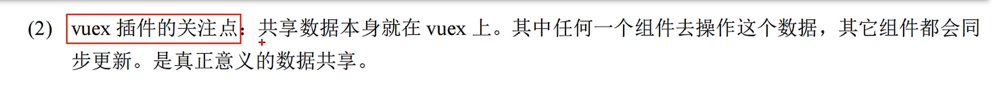

## Vuex环境搭建

+ 案例=点击增加数字

## store.js

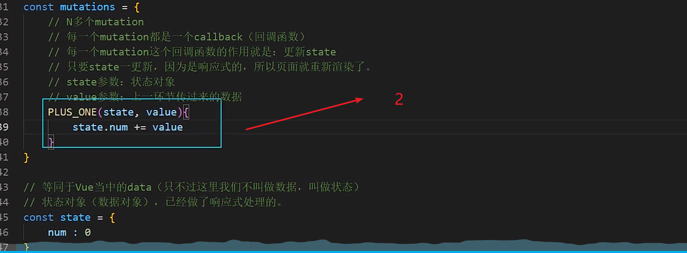

## vuex工作原理

## 案例

+ 组件互传数据

## ES6扩展运算符

## 获取vuex mapState mapGetters

## mapActions  mapMutations

sore.js

## vuex的模块化开发

### a b c 抽成js 

+ 简写形式，加个模块参数

# 路由route

 

 

## 子路由

 

## 路由组件位置-习惯存放位置pages

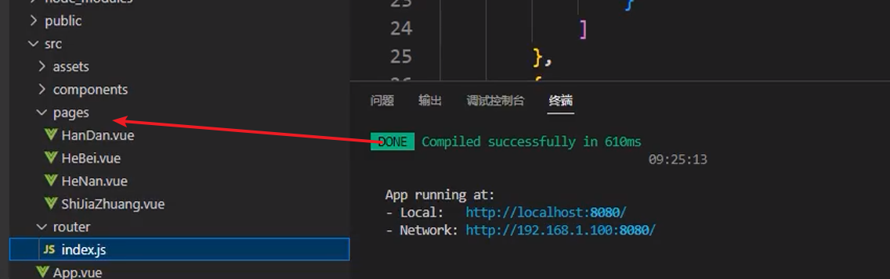

## query传参-路由组件 

+ 各个城市只有数据不同，格式一样，只需传递不同参数即可

+ 最终方案

## prarm传参

+ 如果使用对象传参   --path不可用

## prop接收参数

## 编程式路由导航

### 前进后退

## 切换还保持状态  -include

 

## activated和deactivated钩子

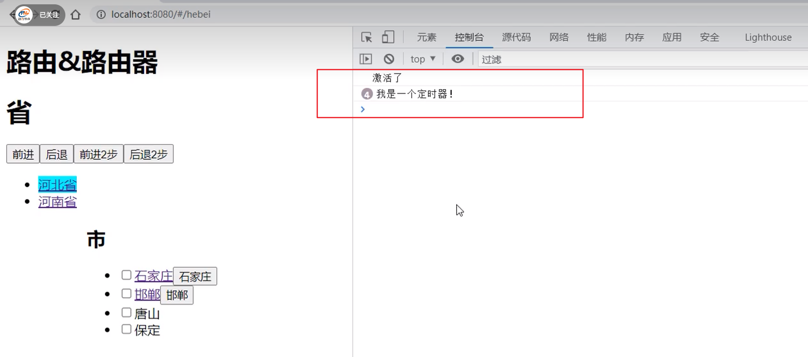

# 路由守卫

## 全局守卫

+ 全局前置守卫  - beforeEach

+ 全局后置守卫  -  router.afterEach

   

## 局部守卫

+ path守卫 --   路由守卫  route

+ component守卫  -路由组件守卫 component

  

# 前端项目上线

# Vue3

+ **main.js  -- vue3**

  

+ **vue2 -main.js**

  

## create-vue创建Vue3工程

## Vite创建项目和webpack创建的区别

## setup()

## 响应式

 

## Vue3中的props

 

## Vue3的生命周期

+ 组合式API  vue3特性
+ Options API Vue3   data, watch...

## 组合式使用生命钩子函数

## Vue3自定义事件  子传父

子：

父：

## Vu3全局事件总线

## 计算属性

+ **vue2**

  

  

+ **Vue3**

## 监听属性 watch

+ **Vue2**

  

### ref包裹

+ **Vue3**

  

### reactive包裹

## watchEffect

## 自定义钩子函数 - hook函数

## shallowReactive和shallowRef

+ **shallowReactive** 

  

## 组合式API和选项式API

## 深只读

## 浅只读

## 响应式数据的判断

## toRef 和 toRefs

## 转换为原始&标记为原始

## Fragment

## Teleport

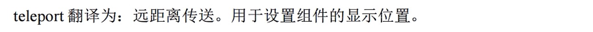

## provide inject

